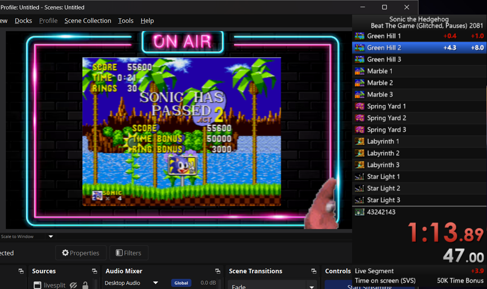
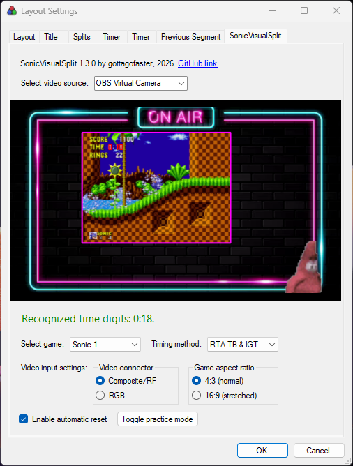

# SonicVisualSplit
An auto-splitter for classic Sonic games on Sega Genesis, which works from visual input.

Splits Sonic 1, 2, and CD using RTA-TBC or IGT.

## Component in action

## System requirements
Required OS version is **Windows 10/11 64-bit** (May 2019 update or newer).

You have to have the latest version of [LiveSplit](http://livesplit.org/downloads/) installed.

If you want to record (or stream) your game footage, you have to have [OBS Studio](https://obsproject.com/) (or other streaming software) installed.

## Installation
1. Install the latest version of Visual C++ Redistributable from [here](https://aka.ms/vs/17/release/vc_redist.x64.exe).
2. Unpack the contents of [SVS.zip](https://github.com/gottagofaster236/SonicVisualSplit/releases/latest/download/SVS.zip)
into the Components directory of your LiveSplit installation.
4. Add the component: open LiveSplit, then right-click LiveSplit, select "Edit layout...", press the big "+" button,
and find SonicVisualSplit under the "Control" category.
4. Then you'll have to setup your video capture to work with SonicVisualSplit.

## Setting up video capture
*Settings page screenshot:*

- To open SonicVisualSplit settings, right-click LiveSplit, click "Edit layout...", click "Layout Settings" at the bottom. Select "SonicVisualSplit" in the top navigation bar.

- If you **don't need to record/stream your runs**, you can just select the your capture card from the video sources dropdown list
(provided that your video capture cards is detected as a webcam on your computer).

- If you **do want to share your runs**, then you'll have use OBS Studio (or alternative streaming software, such as Streamlabs).
  This is due to Windows not allowing two applications to use a webcam simultaneously.
  If you're using OBS, click "Start Virtual Camera" in the bottom right before using SonicVisualSplit. Then select it in the video sources dropdown list in SonicVisualSplit settings.
     
  For Streamlabs, you can read about Virtual Camera installation [here](https://blog.streamlabs.com/streamlabs-obs-now-supports-virtual-camera-9a4e464435c2).
     
  Thus, SonicVisualSplit will capture the virtual camera, while the actual capture card video will be recorded by your streaming software of choice.
 
  In order for SonicVisualSplit to recognize the time on screen correctly, you have to make sure
  that the **<ins>game capture takes at least 80% of the height</ins>** of your stream layout.
- Make sure your capture card outputs an acceptable picture.
   - If your capture card outputs an image that's too dark, you'll have to apply a color correction filter in your streaming software.
     Try increasing gamma/brightness.
   - Check that the aspect ratio of the game is **either 4:3 or 16:9**. If it's stretched, fix it with your streaming software. Note that if the aspect ratio is slightly off, SVS will still work, but with degraded accuracy
- After you setup the video capture correctly, it should appear in the preview.
- Then you have to select the game,
choose the video connector that you use to connect your console to the capture card,
and change the aspect ratio if for some reason your capture card stretches the image.
- The settings are saved with layout.
So, click "yes" when LiveSplit will ask you whether you want to save the layout settings at exit.

## RTA-TB

If you're converting from manual RTA-TB: the component splits on fadeout, like emulator autosplitter.
This is in contrast to manual RTA-TB, where you usually split when the time bonus starts ticking down.
You can take your PB, add it as a video source to OBS, and play it back with LiveSplit running to get proper splits.

If you are running with RTA-TB, then you have to add two timers to your LiveSplit layout, much like with the manual RTA-TB plugin.
One timer has to use Real Time (RTA-TB), and the other Game Time (IGT). 

## Practice mode
The component currently cannot tell whether you just want to practice or start an actual run.
For that in SVS there's *practice mode*. It temporarily disables the component, so that you can practice the game without the timer running.

To toggle the practice mode, press <kbd>Ctrl</kbd> + <kbd>P</kbd> (make sure LiveSplit is the focused window first). 
Alternatively, you can right-click LiveSplit, select "Control", and click "Toggle practice mode" in the bottom.

## Known limitations
- In Sonic 2, when you hit the boss, the timer is flashing and SVS fails to recognize that.
This is fine, it'll recover soon after.
- You must have one split per each act, and the splits should start from the first act. In particular, SVS is (probably) not usable for multi-game runs.
- Sometimes the pause for time bonus can be triggered early, e.g. if you move the screen by looking up and down. 
  Since the length of the pause is the same regardless of when it starts, it doesn't actually affect the time you get.
  
## Troubleshooting
- If SVS prompts you to reset to SEGA screen repeatedly, check that you set the correct game. 
  Also, check if your capture video is too dark. If that's the case, adjust it via a filter in your streaming software.
- If the component fails to read the digits too often,
  check your settings.
  Make sure you selected the correct video mode and the correct game.
  Sometimes *Composite* may work better than *RGB*, even if your capture card is capturing in RGB. Make sure the aspect ratio of the game is either exactly 4:3 or exactly 16:9 in your streaming software. 
  Note that occasional incorrectly recognized frames are fine, thanks to error detection.
- If the game preview shows a blank image on the settings page,
  make sure the camera stream isn't used by another program.
- If you changed your stream layout and moved or resized the game, then reset the game, and reset LiveSplit as soon as you see the SEGA screen.
  You may have to try several times if LiveSplit starts itself up again.
- If your capture card is outputting a dark image, you should apply a color correction filter as described [here](#setting-up-video-capture).
- If you found a bug, please open an issue [here on GitHub](https://github.com/gottagofaster236/SonicVisualSplit/issues/new).
  If it's an issue with time recognizing incorrectly, a video or a screenshot of the game
  at the point where SVS fails would be appreciated.

## Questions / Suggestions
If you couldn't solve your problem or have questions or suggestions, feel free to post them using [GitHub Discussions](https://github.com/gottagofaster236/SonicVisualSplit/discussions). You can also message me [on Discord](https://discordapp.com/users/gottagofaster#3355).

## For developers
Contributions are welcome! You should probably read [BUILDING.md](BUILDING.md) on how to build the project.
